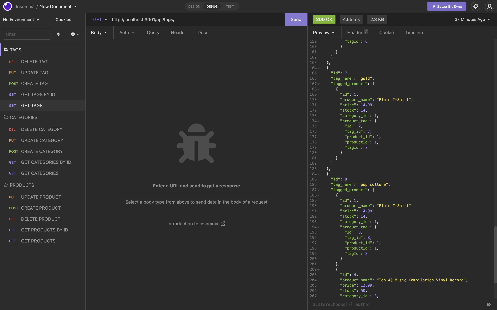

# ORM-e-commerce-website

Express API Project to perform CRUD operation in database using Sequelize and MYSQ2 Packages.
This project creates a API for an ecommerce website which allow the user to get the product,categories
and tag,create new products,categories and tags ,update  products,categories and tags and delete products,
categories and tags using the express routes and sequelize package.

 

## User Story

AS A manager at an internet retail company I WANT a back end for my e-commerce website that uses the latest technologies
SO THAT my company can compete with other e-commerce companies

 

## Acceptance Criteria

GIVEN a functional Express.js API
* WHEN I add my database name, MySQL username, and MySQL password to an environment variable file THEN I am able to connect to a database using Sequelize
* WHEN I enter schema and seed commands THEN a development database is created and is seeded with test data
* WHEN I enter the command to invoke the application THEN my server is started and the Sequelize models are synced to the MySQL database
* WHEN I open API GET routes in Insomnia for categories, products, or tags THEN the data for each of these routes is displayed in a formatted JSON
* WHEN I test API POST, PUT, and DELETE routes in Insomnia  THEN I am able to successfully create, update, and delete data in my database

 

### Technologies/Packages Used

* [x] Node.JS
* [x] Express.JS
* [x] MYSQL2
* [x] SEQUELIZE
* [x] Node.JS
* [x] DOTENV

### Links

VIDEO URL : https://www.loom.com/share/5632f7cb7d034d5e8cb5055820376ec5

Github Repo URL:   https://github.com/simmypayyappillyvarghese/ORM-e-commerce-website

 

### Screenshot

Below is the Screenshot of insomnia with API routes

